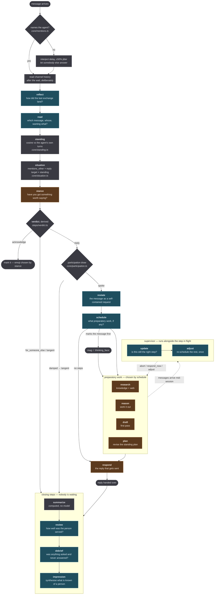
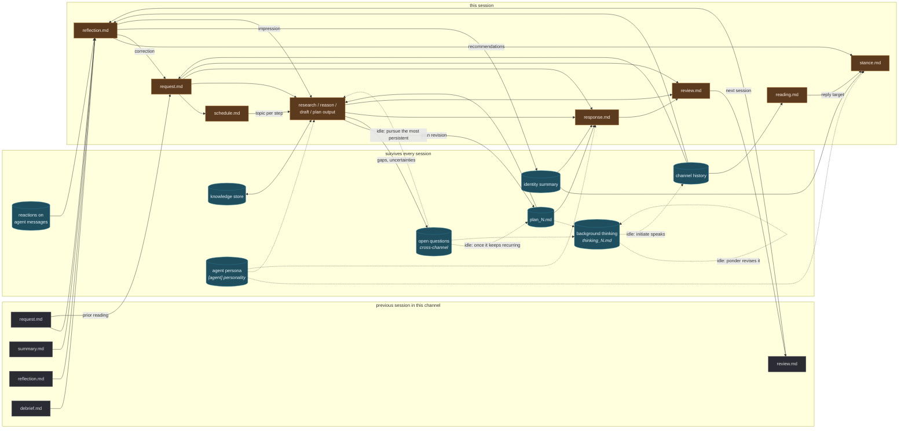
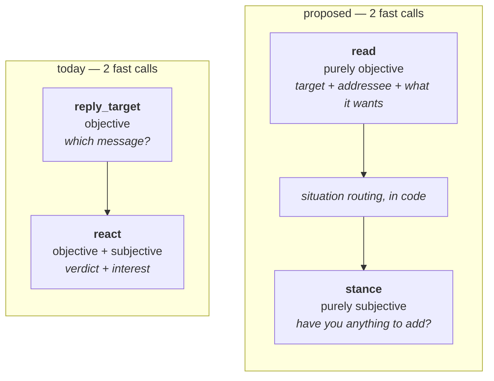

# Session flow

What runs, in what order, and — more usefully — **what output reaches what input**. Written to
support the prompt rewrite and kept as the record of it: every model call here is marked as an
**objective** task (a
mechanical judgement about material, made from outside the conversation) or a **subjective** one
(the agent itself thinking, deciding, or speaking).

That distinction is the point of the document. It decides the voice of the prompt, whether the
agent is addressed as itself or referred to as one participant among several, and — the failure
this is fixing — whether context handed to a step reads as *the agent's own* or as *something the
sender said*.

## Control flow



Dark teal is **objective**, brown is **subjective**, and grey is **decided in code with no model
call at all**. There is no longer a step that is both: `react` was the only one, and splitting it
is what this rewrite turned on.

Note how much of the entry path is grey. Mention detection, standing, situation routing, the
verdict, and the draw are all code; the two model calls answer one question each.

**`acknowledge` branches before the draw, not after it.** An emoji is not a message, it does not
crowd a channel, and damping it leaves the person with nothing at all — the outcome the verdict
exists to avoid. Being damped into silence is recorded as `tangent` instead, which is honest:
the entry steps judged the message worth answering and the draw disagreed.

Two flows are not drawn because they are separate session kinds with their own fixed queues:

- **maintenance** — no message, no entry step, no reply *to anybody who spoke*. Queue comes from
  what `pendingMaintenance` finds, in order: `reflect` on a fresh reaction, then `prune` /
  `impression` / `compact` housekeeping, then `ponder`, then `initiate` — and **only when there
  is nothing left to tidy**, a *pursuit* instead: `research` on whichever open question has come
  up most, plus `plan` once it has come up enough. `respond` is filtered out in code throughout.
  This is the only thing that makes an idle agent do anything, the only path that writes to
  `files/` or starts a plan unasked, and — through `initiate` alone — the only path that speaks
  into a channel nobody prompted.
- **continuation** — after a reply goes out, `[reason] + plan` with `respond` refused, repeating
  while the plan still has outstanding items.

## Data flow

The part worth staring at. Boxes are sealed artifacts; arrows are "is read by".



**The dotted arrows are the only ones that start anything.** Open questions drive an idle agent
to research and to plan; background thinking is what it carries between those intervals; and the
one arrow from thinking back into channel history is `initiate` — the single edge in this whole
diagram where the agent speaks without having been spoken to.

**Everything else here is downstream of somebody talking.** That loop is what the agent had none of: `research` and `reason`
reported what they could not settle, the report was read once in the same session, and it was
gone.

**What the picture shows that the code does not.** Almost everything a subjective step reads is
either the agent's own earlier output (`reflection`, `request`, `research`, `draft`) or a durable
store the harness owns (`knowledge`, `plan`, `identity`). Exactly two inputs come from the other
person: the message, and the transcript. Yet every one of them arrives in the prompt under a
neutral heading in the same undifferentiated wall of markdown, and a local model has no way to
tell which is which. That is the mechanism behind the artifacts in the agent's replies — it reads
its own restated request or its own research notes as something the sender wrote, and answers
them.

## Objective or subjective, per step

The table is the specification for the prompt rewrite.

| step | role | kind | who the prompt addresses |
|---|---|---|---|
| `read` | fast | **objective** | analyst outside the conversation; folds in what was `reply_target` |
| `stance` | fast | **subjective** | the agent, weighing whether it has anything to add |
| `restate` | fast | **objective** | analyst; restates what was asked of a named participant |
| `schedule` | fast | **objective** | analyst; triage over a stated request |
| `adjust` | fast | **objective** | analyst; same question later in the session |
| `update` | fast | **objective** | analyst; relevance of work in flight |
| `research` | reasoning | **subjective** | the agent, gathering for itself |
| `reason` | reasoning | **subjective** | the agent, thinking |
| `draft` | reasoning | **subjective** | the agent, writing a first pass |
| `plan` | reasoning | **subjective** | the agent, committing itself to a course of work |
| `respond` | reasoning | **subjective** | the agent, speaking to a named person |
| `reflect` | digest | **objective** | analyst; it judges an exchange and never speaks |
| `review` | digest | **objective** | analyst reading somebody else's session |
| `debrief` | digest | **objective** | analyst; already correct |
| `impression` | digest | **objective** | analyst reading a record of observations |
| `compact` | digest | **objective** | analyst merging notes |
| `knowledge_gatekeeper` | fast | **objective** | analyst judging a candidate against a shortlist |

Three of these were wrong before this pass; all three are converted.

**`review` was second person about its own session.** CLAUDE.md already flags this and predicts
the failure it produces: a step asked "did *you* do well?" answers yes. It needed an explicit
instruction not to describe a reply that did not exist, which is precisely the failure that
third-party framing prevents. Convert to analyst voice.

**`impression` was second person and should not have been.** It reads a record of observations and
extracts a pattern. Nothing about that is the agent speaking. Framing it as "what *you* make of
this person" invites the model to be generous or defensive about somebody it talks to.

**`reflect` is genuinely mixed, and was the one case for leaving it whole.** It judges the previous
exchange (objective, and the third-party framing matters most here because the work being judged
is the agent's own) but then writes recommendations *for this session* and an impression of the
person. Splitting it doubles the most expensive call that sits at the *start* of a session, where
somebody is waiting. So it was **not split, and converted wholesale to analyst voice**, with
recommendations phrased as instructions to the agent rather than notes to self. The step never
speaks to anybody, so it loses nothing by not being the agent.

## The `react` split

The prime candidate, and it comes out neutral on latency.

`react` decodes four fields in one call and two of them answer unrelated questions:

- `verdict` — what does this message want, and of whom? **Objective.** Settled almost entirely by
  the situation fragment, which is the tuned surface.
- `interest` — how much has the agent got to add? **Subjective.** This is the agent weighing its
  own knowledge and standing, and it is being asked in analyst voice about a third party.

The seam is already visible in the prompt. Widening `verdict` from a boolean to four outcomes
gave the model escape hatches from the fragment's conclusion, and needed a patch sentence saying
the fragment settles the reply and the outcomes only spell out how silence is spelled. That
sentence exists because two questions are sharing one decode.

**The split, and it costs nothing:**



`read` absorbs `reply_target`, so the call count is unchanged: two fast calls before and two
after. Both read the transcript either way.

What it buys:

- **`read` never has to mention the agent as "you".** It names it as one participant among
  several and asks who the final message is aimed at. That kills the disclaimer currently in
  `reply_target` — *"its messages are marked `you`. Ignore that label — you are not that
  participant"* — which is a prompt apologising for the harness's own rendering.
- **`stance` gets the agent's voice, the persona, and the impression of the sender**, which are
  exactly the inputs "have I got something worth saying here?" needs and which an analyst-voiced
  call cannot use.
- **The four-outcome verdict becomes derived rather than decoded.** `wantsReply` is already
  computed in code; after the split the whole verdict is: `read.wants` × `read.addressed_to` ×
  `stance.interest` × the participation draw. Every judgement moved out of the prompt is one
  fewer thing a model swap can break — the project's own stated rule, applied to the last place
  in the entry path where a model still decides a routing question.
- **The situation fragments move to `stance`, where they belong**, and can finally be written in
  second person. They currently ask an agent-shaped question ("does this reach back to something
  the agent said?") in analyst voice, because they are wedged into an objective call.

What it costs: `read` and `stance` are both on the latency path, so a stall in either is a stall
in the reply. That was already true of `reply_target` + `react`.

**A later revision made them unconditional**, including when the agent is named — which does cost
two `fast` calls on a path that used to be free. See "The mention loop" in CLAUDE.md: skipping
them meant nothing knew whether a message naming the agent was a question or a bare
acknowledgement, and two instances naming each other could not stop.

## Prompt structure: frame, then appendices

The second defect the diagram makes visible. Every prompt today is a fixed skeleton of prose with
`${block}` holes in it, and every block renders *something* — so a step that has no draft, no
plan, and no prior output still ships three headings followed by `(no preparatory steps ran)`,
`(nothing was said)`, and so on. The model is handed a form with most fields marked "not
applicable" and asked to write a reply from it.

The replacement:

```
frame        — a few lines. Who is being addressed, what the task is, the two or three
               mandatory parameters inline (${agent_name}, ${sender}, ${incoming_message}).
${context}   — optional appendices, in the step's declared priority order, each under a
               heading chosen by the step's voice, and omitted entirely when empty.
output       — the schema contract.
```

A block therefore gains two things: it may resolve to **nothing at all**, and it carries a
heading per voice. The same `prior_step_output` block appears as **"What you worked out earlier
in this session"** in a subjective step and **"Working notes produced during the session"** in an
objective one. That heading is what tells a 27B that the research summary in front of it is its
own and not something the sender said.

Ordering is by attention, not by budget: the first appendix is the one the step is most likely to
be wrong without. For `respond` and `draft` that is an existing draft; for `reason` it is what
research found; for `restate` it is a correction from `reflect`.

### Appendices as built, in priority order

Mandatory is deliberately thin, and the guard is what made it so: `buildContext` throws when a
step declares an inline block a session cannot supply, so declaring one is a claim that the step
can never be queued without it. Three steps turned out to have no mandatory block at all —
`reason`, `research`, and `plan` run in continuation sessions with no incoming message, and their
whole instruction is `${topic}`.

| step | voice | mandatory, inline | appendices, highest priority first |
|---|---|---|---|
| `read` | observer | `incoming_message` | `message_window` |
| `stance` | agent | `incoming_message`, `situation` | `user_summary`, `recent_messages`, `reflection` |
| `restate` | observer | `incoming_message`, `recent_messages` | `request_correction`, `prior_request` |
| `schedule` | observer | `incoming_message` | `request`, `current_plan`, `reflection`, `user_summary` |
| `adjust` | observer | `mid_session_messages` | `request`, `incoming_message`, `prior_step_output`, `recent_messages` |
| `research` | agent | — (`${topic}`) | `request`, `incoming_message`, `prior_step_output`, `recent_messages`, `reflection` |
| `reason` | agent | — (`${topic}`) | `prior_step_output`, `request`, `incoming_message`, `current_plan`, `recent_messages`, `reflection` |
| `draft` | agent | — (`${topic}`) | `prior_step_output`, `request`, `incoming_message`, `user_summary`, `recent_messages`, `reflection` |
| `plan` | agent | — (`${topic}`) | `current_plan`, `request`, `prior_step_output`, `incoming_message`, `recent_messages` |
| `respond` | agent | `incoming_message` | **`draft`**, `prior_step_output`, `request`, `current_plan`, `user_summary`, `recent_messages` |
| `reflect` | observer | `incoming_message` | `reactions`, `last_contribution`, `prior_request`, `last_review`, `last_debrief`, `last_reflection`, `last_session_summary`, `recent_messages` |
| `review` | observer | `session_summary` | `incoming_message`, `request`, `prior_step_output` |
| `debrief` | observer | `mid_session_messages` | `incoming_message`, `prior_step_output`, `session_summary` |
| `impression` | observer | `identity_impressions` | `user_summary` |
| `compact` | observer | `knowledge_entry` | — |

`draft` is a first-class block now, and `respond`'s first appendix. It used to arrive buried
inside `prior_step_output` — prose in the first person, unlabelled, directly beneath somebody
else's prose in the first person, which made it the single most confusable thing in the prompt.

The guard also found a real bug while the table was being written: `impression` declares its
impressions as mandatory, and a hand-built maintenance trigger could queue it with none. It is
now dropped from the queue in that case, exactly as `compact` already was.

## Two proposed durable fields

Both are optional appendices, both revised off the reply path.

**Agent persona — built, static.** `[agent] personality` in config — rendered inline into
the frame of every subjective step, as in *"You are galatea, a terse and skeptical agent"*. This
is the cheap half, and it is what makes the subjective frames say something rather than merely
address the model as the agent. The self-revising version — a cross-channel document the agent
edits about itself, which the roadmap has as 4c — inherits the same guards as impressions:
append-only revisions and a strong default of leaving it alone. It is worth noting that the
identity impression loop and this one are the only two cross-channel loops in the system, so a
mistake in either does not expire the way a channel-scoped one does.

**Sender impression — built.** Already existed as `user_summary`, already synthesised by `impression`.
What changes is that it stops being a mandatory heading on steps that have nothing in it, and it
gets a voice-appropriate heading — **"What you know about ${sender}"** rather than "Who is
speaking".

## The three artifacts this was chasing, and what became of them

All three are fixed. They are recorded here because each explains a class of artifact in the
agent's replies, and because the second and third are patterns that will recur.

**The harness labelled the agent's own messages two different ways, and one prompt was wrong
about it.** *(Fixed: every turn now carries its author's name, the agent's included.)* `core/window.ts` renders them as `you`; `recent_messages` renders `author`, which
`instance/run.ts` writes as the literal string `"agent"` — not `config.agent.name`. So
`reply_target` has to disclaim the `you` it was handed, and `react_1.md` correctly states that
the agent appears as `agent` while the same session's `reply_target` sees `you`. In a channel with
two instances, one agent's own turns read `agent` and its sibling's read `nephele`, so the
transcript is not a neutral record of who said what — it silently encodes a point of view. For an
objective step that must treat the agent as one candidate among many, this is the wrong shape
before a single word of prompt is written.

**Placeholder prose was indistinguishable from content.** *(Fixed: a block resolving to nothing
is omitted, heading and all.)* `(no preparatory steps ran)`, `(nothing
known about them yet)`, `(the message was not restated; read it as written)` all arrive under a
heading, in the same markdown, as the real thing. Omission is the correct semantics and it is
free.

**`prior_step_output` flattened ownership.** *(Fixed: voice-specific headings, and `draft` is now
its own block.)* Research findings, a draft reply, and a plan revision
arrive under one heading — *"What earlier steps produced"* — with no statement that they are the
agent's own. `respond` then reads a draft written in the agent's voice directly beneath the
sender's message and has to work out which is which.
